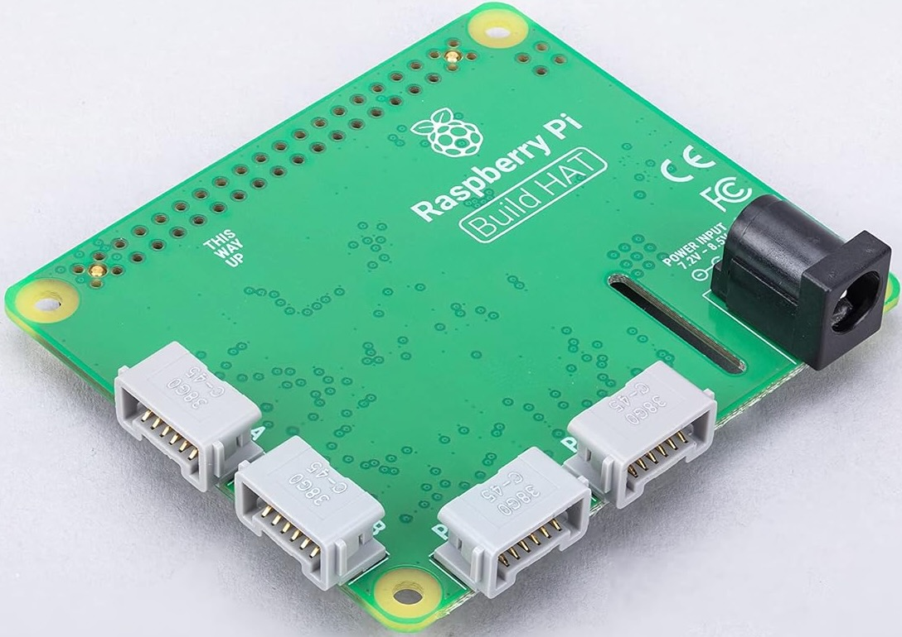

# README #

A little experiment with RaspberryPi and AI.

### Objective
We will control a LEGO motor using voice commands.

### Setup and Approach
The Raspberry Pi [Build HAT](https://buildhat.readthedocs.io/en/latest/buildhat/index.html) helps us connect to the [LEGO Motor](https://buildhat.readthedocs.io/en/latest/buildhat/motor.html). The python APIs let us programmatically control the motor. These APIs are rather cryptic, such as `run_for_degrees()`, `run_for_rotations()`, `run_to_position()`, etc. Instead, instructions such as `Please turn left and then turn right twice.` are more human-friendly. We will use an LLM (Claude Sonnet) and ReAct (Reasoning and Acting) to translate the user's instructions into the low-level motor APIs.

### Jupyter Notebook Example

To run the notebook(s) in this repo, make sure you have installed the required libraries, and acquired the Claude and OpenAI API keys. Start jupyter with the below command:
```
cd ai_raspberrypi_notebooks

export CLAUDE_API_KEY=<api_key> && export CLAUDE_API_URL=https://api.anthropic.com/v1/messages \
  && export CLAUDE_API_VER=2023-06-01 && export OPENAI_API_KEY=<api_key>; jupyter notebook
```

Check out the notebook [test_control.ipynb](https://github.com/shubhomoydas/ai_raspberrypi/blob/main/ai_raspberrypi_notebooks/test_control.ipynb). Here, we have shown how `Please turn left and then turn right twice.` gets translated into three motor instructions by ReAct:
```
{'blocking': True, 'degrees': 90, 'name': 'run_for_degrees', 'speed': -50}
{'blocking': True, 'degrees': 90, 'name': 'run_for_degrees', 'speed': 50}
{'blocking': True, 'degrees': 90, 'name': 'run_for_degrees', 'speed': 50}
```

ReAct also shows its reasoning for each action:
```
[{'Action': {'blocking': True,
             'degrees': 90,
             'name': 'run_for_degrees',
             'speed': -50},
  'Thought': 'I need to break this down into three steps: 1) turn left (90 '
             'degrees), 2) turn right (90 degrees), and 3) turn right again '
             "(90 degrees). Since turning involves rotation, I'll use "
             "run_for_degrees. For left turn, I'll use negative speed, and for "
             'right turns, positive speed.'},
 {'Action': {'blocking': True,
             'degrees': 90,
             'name': 'run_for_degrees',
             'speed': 50},
  'Thought': 'Good, the left turn is complete. Now I need to execute the first '
             'right turn.'},
 {'Action': {'blocking': True,
             'degrees': 90,
             'name': 'run_for_degrees',
             'speed': 50},
  'Thought': 'The first right turn is complete. Now I need to execute the '
             'second right turn.'}]
```

The ReAct prompt for the LLM can be seen in [motor_control.py](https://github.com/shubhomoydas/ai_raspberrypi/blob/main/ai_raspberrypi_notebooks/experiments/motor_control.py).

## Hardware / Software

### Hardware

  - RaspberryPi 5
  - Raspberry Pi Build HAT
  - Lego Motor
  - USB speaker for Raspberry Pi
  - USB microphone for Raspberry Pi

More details are in Section [Hardware details](#hardware-details) below.

### Software / AI:
  - TigerVNC (connect to Raspberry Pi)
  - Python 3.11
  - Claude (might use OpenAI GPT-4*) is being used for LLM completion -- an API key will be required
  - OpenAI models being used for text-to-speech and speech-to-text -- an API key will be required

I use a Macbook Pro for development, hence the commands and instructions are biased towards that.

Use the below command to get to the python shell:
```
export CLAUDE_API_KEY=<api_key> && export CLAUDE_API_URL=https://api.anthropic.com/v1/messages \
  && export CLAUDE_API_VER=2023-06-01 && export OPENAI_API_KEY=<api_key>; python
```

## Python

#### Check if LEGO motor setup is OK

Below code will test if the LEGO motor is working fine.

```python

from buildhat import Motor

motor_a = Motor('A')

motor_a.run_for_seconds(5)

motor_a.run_for_seconds(5, speed=50)
motor_a.run_for_seconds(5, speed=-50, blocking=False)

motor_a.run_for_degrees(360, speed=None, blocking=False)

motor_a.run_to_position(degrees=180, speed=None, blocking=True, direction='shortest')

motor_a.run_for_degrees(-360)

motor_a.run_for_rotations(rotations=2, speed=None, blocking=False)

motor_a.set_default_speed(default_speed=50)

motor_a.start()

motor_a.stop()


def handle_motor(speed, pos, apos):
    """Motor data

    :param speed: Speed of motor
    :param pos: Position of motor
    :param apos: Absolute position of motor
    """
    print("Motor", speed, pos, apos)
    

for i in range(2):
    motor_a.run_for_rotations(rotations=2)
    motor_a.run_for_rotations(rotations=-2)


motor_a.when_rotated = handle_motor


i = 0
while i < 10:
    
    print("Position: ", motor_a.get_aposition())
    
    motor_a.run_for_seconds(5, speed=50)
    
    i += 1

```

#### Start jupyter notebook
```
cd ~/work/git/raspi

source ~/work/venv/python311_raspi/bin/activate

export CLAUDE_API_KEY=<api_key> && export CLAUDE_API_URL=https://api.anthropic.com/v1/messages \
  && export CLAUDE_API_VER=2023-06-01 && export OPENAI_API_KEY=<api_key>; jupyter notebook --no-browser --port 8896
```

#### Important links for help on audio
  - https://www.geeksforgeeks.org/python/create-a-voice-recorder-using-python/
  - https://platform.openai.com/docs/guides/text-to-speech
  - https://github.com/openai/openai-python/blob/main/src/openai/helpers/local_audio_player.py
  - https://raspberrypi.stackexchange.com/questions/7088/playing-audio-files-with-python
  - http://stackoverflow.com/questions/43941716/ddg#43950755


#### Install required python libraries
**IMPORTANT**: These must be run on Raspberry Pi
```
# sudo apt-get install libportaudio2

# pip3 install buildhat

# pip install sounddevice wavio scipy openai

# pip install jupyter
```

#### Setup for installing portaudio on Macbook, i.e., OSX (required by pyaudio)
**IMPORTANT**: these are optional and should be run on Macbook to setup local development
```
brew install portaudio
brew install ffmpeg
python3 -m pip install --upgrade pip setuptools
python3 -m pip install pyaudio --global-option="build_ext" --global-option="-I/opt/homebrew/include" --global-option="-L/opt/homebrew/lib"
pip install pydub
```

#### Setup for enabling audio output on Raspberry Pi
**IMPORTANT**: these must be run ON THE Raspberry Pi
```
sudo apt-get install ffmpeg

sudo apt-get install portaudio19-dev

sudo apt-get install python3-dev

pip install pyaudio

pip install pydub pyaudio
```

#### Setting up the python virtual env
**NOTE**: These should be run ON THE Raspberry PI
```
mkdir ~/work/venv

/Library/Frameworks/Python.framework/Versions/3.11/bin/python3 -m venv ~/work/venv/python311_raspi

python3 -m venv ~/work/venv/python311_raspi

source ~/work/venv/python311_raspi/bin/activate
```

## Raspberry Pi setup

#### Connecting to Raspberry Pi with a GUI

Use *TigerVNCViewer* to connect to Raspberry Pi UI.

```
ssh shubhomoydas@192.168.1.82

sudo raspi-config
```
From the menu, use **Interface Options** to enable VNC


#### Shutdown raspberry pi
```
sudo shutdown -h now
```

## Git

The below might fail in case we have default ssh key configured for another bitbucket repository.
```
git clone git@bitbucket.org:shubhomoy_das/raspi.git
```

If the above fails, `ssh-agent bash -c ` commands below can be used.
```
ssh-agent bash -c 'ssh-add ~/.ssh/id_rsa_github_personal; git clone git@github.com:shubhomoydas/ai_raspberrypi.git'

ssh-agent bash -c 'ssh-add ~/.ssh/id_rsa_github_personal; git fetch'

ssh-agent bash -c 'ssh-add ~/.ssh/id_rsa_github_personal; git pull origin'

ssh-agent bash -c 'ssh-add ~/.ssh/id_rsa_github_personal; git push origin'
```

## Hardware details
### RaspberryPi 5
[CanaKit Raspberry Pi 5 Starter Kit PRO - Turbine Black (128GB Edition) (8GB RAM)](https://www.amazon.com/dp/B0CRSNCJ6Y)


### Raspberry Pi Build HAT
[Raspberry Pi Build HAT](https://www.amazon.com/dp/B09JSJYH8T)


### Lego Motor
[LEGO Technic Medium Angular Motor by LEGO Education (45603)](https://www.amazon.com/dp/B07QN7ZJZT)


### USB speaker for Raspberry Pi
[USB Mini Speaker Computer Speaker Powered Stereo Multimedia Speaker for Notebook Laptop PC(Black)](https://www.amazon.com/dp/B075M7FHM1)


### USB microphone for Raspberry Pi
[2 Pcs USB 2.0 Mini Microphone for Raspberry Pi 5 4 Model B, Module 3B+, Laptop/Desktop PC Plug and Play for Skype, MSN, Yahoo Recording, YouTube, Google Voice Search and Games](https://www.amazon.com/dp/B0CYM618H7)

